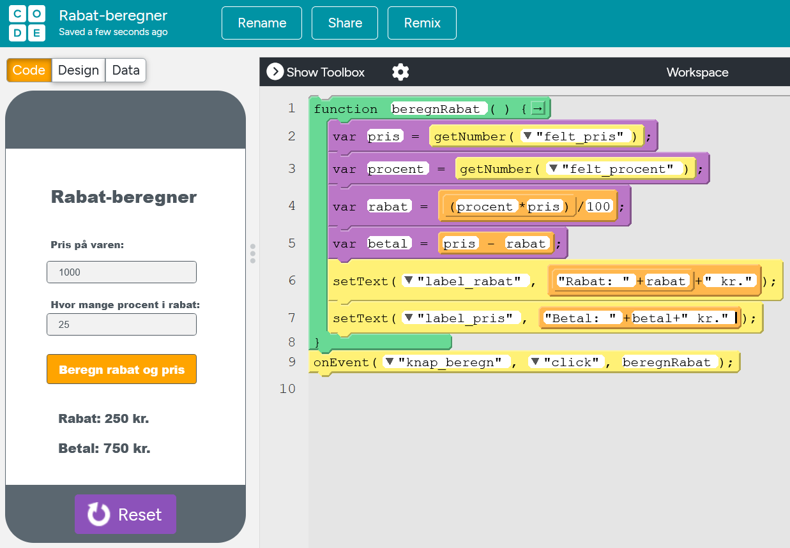

# Programmering

## Rabat-beregner (funktioner, variabler, sekvenser, input/output)

a) Gennemgå designet og koden i rabat-beregner vist på ovenstående figur.
b) Prøv at genskabe designet  i dit eget projekt i App Lab.
c) Prøv at genskabe kode-blokkene i  App Lab.
d) Test din rabat-beregner med forskellige priser og rabatprocenter for at sikre, at den fungerer korrekt.
e) Identificer og forklar de forskellige dele af koden, herunder funktioner, variabler, input og output.

## Login-system (betingede udførsler, variabler, sekvenser, input/output)

## Skift skærm

a) Tilføj to skærme  til din app (Screen1 og Screen2).
b) Tilføj en knap på hver skærm.
c) Tilføj hændelsesbehandlere til begge knapper. Vink: Brug `onEvent()`, der lytter efter "click" hændelsen. Husk at angive knap-id'et og funktionen, der skal udføres, når knappen trykkes. F.eks. `onEvent("knap1", "click", function() { ... });`. Her skal du erstatte "knap1" med det faktiske id for knappen på den pågældende skærm. De tre prikker (...) skal erstattes med den kode, der skifter skærm. Du kan bruge `setScreen()` funktionen til at skifte mellem skærmene. Husk at angive det korrekte skærm-id som parameter til `setScreen()`.
d) Når knappen på Screen1 trykkes skift til Screen2. Vink: Benyt `setScreen()`.
e) Når knappen på Screen2 trykkes skift tilbage til Screen1. Vink: Benyt `setScreen()`.

## Skift baggrundsfarve

a) Tilføj tre knapper: Rød, Grøn, Blå. Vink: Brug `Button` komponenten og giv hver knap et unikt id, f.eks. "rodKnap", "groenKnap", "blaaKnap".
b) Tilføj en hændelsesbehandler til hver knap. Vink: Brug `onEvent()`. Dvs. `onEvent("rodKnap", "click", function() { ... });`, `onEvent("groenKnap", "click", function() { ... });`, `onEvent("blaaKnap", "click", function() { ... });`. De tre prikker (...) skal erstattes med den kode, der ændrer baggrundsfarven.
c) Når en knap trykkes skal baggrundsfarven ændres til den valgte farve. Vink: Brug `setProperty()` til at ændre baggrundsfarven. F.eks. `setProperty("screen1", "background-color", "red");` for rød knap, `setProperty("screen1", "background-color", "green");` for grøn knap, og `setProperty("screen1", "background-color", "blue");` for blå knap. Husk at bruge det korrekte skærm-id i `setProperty()` funktionen.

## Hent tekst fra et tekstinputfelt

a) Tilføj et tekstinputfelt og en knap. Vink: Brug `TextInput`-komponenten. Giv tekstinputfeltet et id, f.eks. "tekst".
b) Tilføj en knap og en etiket. Vink: Husk at give knappen og etiketten id'er, f.eks. "hentKnap" og "visTekst".
c) Tilføj en hændelsesbehandler til knappen. Vink: Brug `onEvent()` ligesom før. Dvs. `onEvent("hentKnap", "click", function() { ... });`. De tre prikker (...) skal erstattes med den kode, der henter teksten og opdaterer etiketten.
d) Når knappen trykkes skal teksten fra tekstinputfeltet hentes og vises i etiketten. Vink: Brug `getText()` til at hente teksten fra tekstinputfeltet og `setText()` til at opdatere etiketten med den hentede tekst. Husk at bruge de korrekte id'er for tekstinputfeltet og etiketten i dine funktioner. F.eks. `let tekst = getText("tekst");` og `setText("visTekst", tekst);`.

## Quiz: Gæt et ord

a) Tilføj et tekstinputfelt, en knap og en etiket. Vink: Brug `TextInput`, `Button` og `Label` komponenterne. Giv tekstinputfeltet et id, f.eks. "gaetOrd".
b) Opret en variabel `hemmeligtOrd`, der indeholder et ord, som brugeren skal gætte. Vink: Brug `let hemmeligtOrd = "ditOrd";` øverst i din kode. Erstat "ditOrd" med det ord, du ønsker.
c) Tilføj en hændelsesbehandler til knappen. Vink: Brug `onEvent()`. Dvs. `onEvent("gaetKnap", "click", function() { ... });`. De tre prikker (...) skal erstattes med den kode, der kontrollerer brugerens gæt.
d) Når knappen trykkes skal programmet kontrollere brugerens gæt mod `hemmeligtOrd`. Vink: Brug `getText()` til at hente brugerens gæt fra tekstinputfeltet. Brug betingede udførsler (if/else) til at sammenligne brugerens gæt med `hemmeligtOrd`. Hvis de er ens, skal etiketten opdateres til at vise en succesbesked (f.eks. "Tillykke! Du gættede rigtigt!"). Hvis de ikke er ens, skal etiketten opdateres til at vise en fejlbesked (f.eks. "Forkert gæt. Prøv igen!"). Brug `setText()` til at opdatere etiketten.

## Beregn sum af to tal

a) Tilføj to tekstinputfelter og en knap. Vink: Brug `TextInput` komponenten. Husk at give tekstinputfelterne id'er, f.eks. "tal1Input" og "tal2Input" samt knappen id'et "beregnKnap".
b) Tilføj en etiket til at vise resultatet. Vink: Brug `Label` komponenten og giv etiketten et id, f.eks. "resultatEtiket".
c) Tilføj en hændelsesbehandler til knappen. Vink: Brug `onEvent()`. Dvs. `onEvent("beregnKnap", "click", function() { ... });`. De tre prikker (...) skal erstattes med den kode, der beregner summen.
d) Når knappen trykkes skal programmet hente de to tal fra tekstinputfelterne, beregne summen og vise resultatet i etiketten. Vink: Brug `getText()` til at hente tallene og gem dem i variabler, f.eks. `let tal1 = parseFloat(getText("tal1Input"));` og `let tal2 = parseFloat(getText("tal2Input"));`. 
e) Beregn summen med `let sum = tal1 + tal2;` og vis resultatet i etiketten med `setText("resultatEtiket", "Summen er: " + sum);`.

## Vis en besked

a) Tilføje en knap og en etiket. Vink: Brug `Button` og `Label` komponenterne. Husk at give knappen og etiketten id'er, f.eks. "visBeskedKnap" og "beskedEtiket".
b) Tilføj en hændelsesbehandler til knappen. Vink: Brug `onEvent()`. Dvs. `onEvent("visBeskedKnap", "click", function() { ... });`. De tre prikker (...) skal erstattes med den kode, der viser beskeden.
c) Når knappen trykkes skal der vises en besked i etiketten (f.eks. "Hej Verden!"). Vink: Brug `setText()` til at opdatere etiketten.

## Vis en besked baseret på brugerinput

a) Tilføj et tekstinputfelt, en knap og en etiket. Vink: Brug `TextInput`, `Button` og `Label` komponenterne. Husk at give tekstinputfeltet, knappen og etiketten id'er, f.eks. "inputFelt", "visBeskedKnap" og "beskedEtiket".
b) Tilføj en hændelsesbehandler til knappen. Vink: Brug `onEvent()`. Dvs. `onEvent("visBeskedKnap", "click", function() { ... });`. De tre prikker (...) skal erstattes med den kode, der henter brugerinput og viser beskeden.
c) Når knappen trykkes skal teksten fra tekstinputfeltet hentes og vises i etiketten. Vink: Brug `getText()` til at hente teksten og `setText()` til at opdatere etiketten.

## Tæl klik

a) Tilføj en knap og en etiket. Vink: Brug `Button` og `Label` komponenterne. Husk at give knappen og etiketten id'er, f.eks. "klikKnap" og "antalEtiket".
b) Opret en variabel `antalKlik`, som starter på 0. Vink: Brug `let antalKlik = 0;` øverst i din kode
c) Hver gang knappen trykkes skal `antalKlik` øges med 1, og den nye værdi skal vises i etiketten. Vink: Brug `onEvent()` til knappen og `setText()` til etiketten. Dvs. `onEvent("klikKnap", "click", function() { ... });`. De tre prikker (...) skal erstattes med koden, der øger `antalKlik` og opdaterer etiketten. Her kan du bruge `antalKlik = antalKlik + 1;` eller `antalKlik++;` for at øge tælleren og `setText("antalEtiket", antalKlik);` for at vise den nye værdi i etiketten.

## Rabatberegner

a) Tilføj to tekstinputfelter til pris og rabatprocent. Vink: Brug `TextInput` komponenten. Husk at give tekstinputfelterne id'er, f.eks. "prisInput" og "rabatInput".
b) Tilføj en knap og en etiket til at vise den endelige pris. Vink: Brug `Button` og `Label` komponenterne. Husk at give knappen og etiketten id'er, f.eks. "beregnKnap" og "endeligPrisEtiket".
c) Tilføj en hændelsesbehandler til knappen. Vink: Brug `onEvent()`. Dvs. `onEvent("beregnKnap", "click", function() { ... });`. De tre prikker (...) skal erstattes med den kode, der beregner den endelige pris.
    - Brug `getText()` til at hente pris og rabatprocent fra tekstinputfelterne og gem disse værdier i variabler, f.eks. `let pris = parseFloat(getText("prisInput"));` og `let rabatProcent = parseFloat(getText("rabatInput"));`. - Beregn den endelige pris med formlen: `let endeligPris = pris - (pris * (rabatProcent / 100));`. 
    - Brug `setText()` til at opdatere etiketten med den beregnede endelige pris, f.eks. `setText("endeligPrisEtiket", endeligPris.toFixed(2) + " kr.");`.

## BMI-beregner

a) Tilføj to tekstinputfelter til vægt (i kg) og højde (i meter). Vink: Brug `TextInput` komponenten.
b) Tilføj en knap og en etiket til at vise BMI. Vink: Brug `Button` og `Label` komponenterne. Husk at give knappen og etiketten id'er, f.eks. "beregnBMIKnap" og "bmiEtiket".
c) Tilføj en hændelsesbehandler til knappen. Vink: Brug `onEvent()`. Dvs. `onEvent("beregnBMIKnap", "click", function() { ... });`. De tre prikker (...) skal erstattes med den kode, der beregner BMI.
d) Når knappen trykkes skal BMI beregnes og vises i etiketten. Vink: Brug `getText()` til at hente vægt og højde fra tekstinputfelterne og gem disse værdier i variabler, f.eks. `let vaegt = parseFloat(getText("vaegtInput"));` og `let hoejde = parseFloat(getText("hoejdeInput"));`. Beregn BMI med formlen: `let bmi = vaegt / (hoejde * hoejde);`. Brug `setText()` til at opdatere etiketten med den beregnede BMI, f.eks. `setText("bmiEtiket", "Dit BMI er: " + bmi.toFixed(2));`.

## Antal kalorier

a) Tilføj tre tekstinputfelter til fedt, kulhydrater og protein (i gram). Vink: Brug `TextInput` komponenten. Husk at give tekstinputfelterne id'er, f.eks. "fedtInput", "kulhydratInput" og "proteinInput".
b) Tilføj en knap og en etiket til at vise det samlede antal kalorier. Vink: Brug `Button` og `Label` komponenterne. Husk at give knappen og etiketten id'er, f.eks. "beregnKalorierKnap" og "kalorierEtiket".
c) Tilføj en hændelsesbehandler til knappen. Vink: Brug `onEvent()`. Dvs. `onEvent("beregnKalorierKnap", "click", function() { ... });`. De tre prikker (...) skal erstattes med den kode, der beregner det samlede antal kalorier.
d) Når knappen trykkes skal det samlede antal kalorier beregnes og vises i etiketten. Vink: Brug `getText()` til at hente fedt, kulhydrater og protein fra tekstinputfelterne og gem disse værdier i variabler, f.eks. `let fedt = parseFloat(getText("fedtInput"));`, `let kulhydrater = parseFloat(getText("kulhydratInput"));` og `let protein = parseFloat(getText("proteinInput"));`. 
e) Beregn det samlede antal kalorier med formlen: `let samletKalorier = (fedt * 9) + (kulhydrater * 4) + (protein * 4);`. 
f) Brug `setText()` til at opdatere etiketten med det beregnede antal kalorier, f.eks. `setText("kalorierEtiket", "Samlet antal kalorier: " + samletKalorier);`.

## Gæt et tal

a) Tilføj et tekstinputfelt, en knap og en etiket. Vink: Brug `TextInput`, `Button` og `Label` komponenterne. Husk at give tekstinputfeltet, knappen og etiketten id'er, f.eks. "gaetTalInput", "gaetTalKnap" og "resultatEtiket".
b) Tilføj en hændelsesbehandler til knappen. Vink: Brug `onEvent()`. Dvs. `onEvent("gaetTalKnap", "click", function() { ... });`. De tre prikker (...) skal erstattes med den kode, der kontrollerer brugerens gæt.
c) Opret en variabel `hemmeligtTal`, der indeholder et tal mellem 1 og 100, som brugeren skal gætte. Vink: Brug `let hemmeligtTal = 42;`. Erstat 42 med det ønskede tal.
d) Når knappen trykkes skal programmet kontrollere brugerens gæt mod `hemmeligtTal`. Vink: Brug `getText()` til at hente brugerens gæt fra tekstinputfeltet og gem det i en variabel, f.eks. `let brugerGaet = parseInt(getText("gaetTalInput"));`.
e) Brug betingede udførsler (if/else if/else) til at sammenligne `brugerGaet` med `hemmeligtTal`. Opdater etiketten med passende beskeder baseret på sammenligningen:

- Hvis brugerGaet er mindre end hemmeligtTal vis "For lavt! Prøv igen."
- Hvis brugerGaet er større end hemmeligtTal vis "For højt! Prøv igen."
- Hvis brugerGaet er lig med hemmeligtTal vis "Tillykke! Du gættede rigtigt!".

## Rabat hvis beløbet er over 500

a) Tilføj et tekstinputfelt til beløb, etiket til at vise den endelige pris og en knap. Vink: Brug `TextInput`, `Label` og `Button` komponenterne. Husk at give tekstinputfeltet, knappen og etiketten id'er, f.eks. "belobInput", "beregnPrisKnap" og "endeligPrisEtiket".
b) Tilføj en hændelsesbehandler til knappen. Vink: Brug `onEvent()`. Dvs. `onEvent("beregnPrisKnap", "click", function() { ... });`. De tre prikker (...) skal erstattes med den kode, der beregner den endelige pris.
c) Når knappen trykkes skal programmet hente beløbet fra tekstinputfeltet og kontrollere, om det er over 500. Vink: Brug `getText()` til at hente beløbet og gem det i en variabel, f.eks. `let belob = parseFloat(getText("belobInput"));`.
d) Brug betingede udførsler (if/else) til at anvende rabatten:
- Hvis belob er større end 500 → beregn den endelige pris med 10% rabat: `let endeligPris = belob * 0.9;`
- Ellers → den endelige pris er lig med belob: `let endeligPris = belob;`
e) Brug `setText()` til at opdatere etiketten med den beregnede endelige pris, f.eks. `setText("endeligPrisEtiket", "Endelig pris: " + endeligPris.toFixed(2) + " kr.");`.

## Temperaturkonvertering

a) Tilføj et tekstinputfelt til temperatur i Celsius, en knap og en etiket til at vise temperaturen i Fahrenheit. Vink: Brug `TextInput`, `Button` og `Label` komponenterne. Husk at give tekstinputfeltet, knappen og etiketten id'er, f.eks. "celsiusInput", "konverterKnap" og "fahrenheitEtiket".
b) Tilføj en hændelsesbehandler til knappen. Vink: Brug `onEvent()`. Dvs. `onEvent("konverterKnap", "click", function() { ... });`. De tre prikker (...) skal erstattes med den kode, der konverterer temperaturen.
c) Når knappen trykkes skal programmet hente temperaturen i Celsius fra tekstinputfeltet. Vink: Brug `getText()` til at hente temperaturen og gem den i en variabel, f.eks. `let celsius = parseFloat(getText("celsiusInput"));`.
d) Konverter temperaturen til Fahrenheit med formlen: `let fahrenheit = (celsius * 9/5) + 32;`.
e) Brug `setText()` til at opdatere etiketten med den konverterede temperatur, f.eks. `setText("fahrenheitEtiket", "Temperatur i Fahrenheit: " + fahrenheit.toFixed(2) + " F");`.

## Harris-Benedict-ligningen for mænd/kvinder 

a) Tilføj tekstinputfelter til vægt (kg), højde (cm), alder (år) og radioknapper til at vælge køn (mand/kvinde). Vink: Brug `TextInput` og `RadioButton` komponenterne. Husk at give tekstinputfelterne og radioknapperne id'er, f.eks. "vaegtInput", "hoejdeInput", "alderInput", "mandKnap" og "kvindeKnap".
b) Tilføj en knap og en etiket til at vise det basale stofskifte. Vink: Brug `Button` og `Label` komponenterne. Husk at give knappen og etiketten id'er, f.eks. "beregnBMRKnap" og "bmrEtiket".
c) Tilføj en hændelsesbehandler til knappen. Vink: Brug `onEvent()`. Dvs. `onEvent("beregnBMRKnap", "click", function() { ... });`. De tre prikker (...) skal erstattes med den kode, der beregner BMR.
d) Når knappen trykkes skal programmet hente vægt, højde og alder fra tekstinputfelterne og køn fra radioknapperne. Vink: Brug `getText()` til at hente værdierne og gem dem i variabler, f.eks. `let vaegt = parseFloat(getText("vaegtInput"));`, `let hoejde = parseFloat(getText("hoejdeInput"));`, `let alder = parseInt(getText("alderInput"));`, og `let erMand = getChecked("mandKnap");`. Bemærk: `getChecked()` returnerer sandt (true), hvis radioknappen er valgt, ellers falsk (false).
e) Brug betingede udførsler (if/else) til at beregne BMR baseret på køn:
- Hvis erMand er sand brug formlen: `let bmr = 88.362 + (13.397 * vaegt) + (4.799 * hoejde) - (5.677 * alder);`
- Ellers → brug formlen: `let bmr = 447.593 + (9.247 * vaegt) + (3.098 * hoejde) - (4.330 * alder);`
f) Brug `setText()` til at opdatere etiketten med den beregnede BMR, f.eks. `setText("bmrEtiket", "Dit basale stofskifte (BMR) er: " + bmr.toFixed(2) + " kcal/dag");`.

## Find største tal

a) Tilføj to tekstinputfelter til tal, en knap og en etiket. Vink: Brug `TextInput`, `Button` og `Label` komponenterne. Husk at give tekstinputfelterne, knappen og etiketten id'er, f.eks. "tal1Input", "tal2Input", "findStoersteKnap" og "stoersteEtiket".
b) Tilføj en hændelsesbehandler til knappen. Vink: Brug `onEvent()`. Dvs. `onEvent("findStoersteKnap", "click", function() { ... });`. De tre prikker (...) skal erstattes med den kode, der finder det største tal.
c) Når knappen trykkes skal programmet hente de to tal fra tekstinputfelterne. Vink: Brug `getText()` til at hente tallene og gem dem i variabler, f.eks. `let tal1 = parseFloat(getText("tal1Input"));` og `let tal2 = parseFloat(getText("tal2Input"));`.
d) Brug betingede udførsler (if/else) til at sammenligne de to tal og finde det største:
- Hvis tal1 er større end tal2 det største tal er tal1.
- Ellers det største tal er tal2.
e) Brug `setText()` til at opdatere etiketten med det største tal, f.eks. `setText("stoersteEtiket", "Det største tal er: " + stoersteTal);`, hvor `stoersteTal` er den variabel, der indeholder det største tal.

## Multiplikationstabel

a) Tilføj et tekstinputfelt til et tal og en variabel til at gemme dette tal. Vink: Brug `let tal = 0;` øverst i din kode.
b) Tilføj en knap og en etiket til at vise multiplikationstabellen.
c) Når knappen trykkes → skal programmet generere og vise multiplikationstabellen for det indtastede tal (fra 1 til 10) i etiketten. Vink: Brug `onEvent()` til knappen og `setText()` til etiketten. Brug en løkke (for-løkke) til at generere tabellen og opbygge en tekststreng, der indeholder resultaterne.

## Udskriv liste af byer

a) Opret en liste (array) med mindst fem bynavne. Vink: Brug `let byer = ["København", "Aarhus", "Odense", "Aalborg", "Esbjerg"];` øverst i din kode.
b) Tilføj en knap og en etiket til at vise byerne.
c) Når knappen trykkes skal programmet gennemgå listen og vise alle byer i etiketten. Vink: Brug `onEvent()` til knappen og `setText()` til etiketten. Brug en løkke (for-løkke) til at gennemgå listen og opbygge en tekststreng med bynavnene.

## Lommeregner

a) Tilføj to tekstinputfelter til tal og en variabel til at gemme hvert tal. Vink: Brug `let tal1 = 0;` og `let tal2 = 0;` øverst i din kode.
b) Tilføj fire knapper til de grundlæggende operationer: Addition, Subtraktion, Multiplikation og Division.
c) Tilføj en etiket til at vise resultatet.
d) Opret fire funktioner: addere(), subtrahere(), multiplicere() og dividere(). Hver funktion skal tage to parametre og returnere resultatet af den tilsvarende operation. Vink: Tilføj funktionerne øverst i din kode. Definér dem som f.eks. `function addere(a, b) { return a + b; }`, `function subtrahere(a, b) { return a - b; }` osv.
e) Når en af knapperne trykkes → skal funktionen kaldes med de to tal og resultatet vises i etiketten. Vink: Brug `onEvent()` til hver knap og `setText()` til etiketten.

## Tælle til 10

a) Tilføj en knap og en etiket.
b) Når knappen trykkes skal en løkke tælle fra 1 til 10, og hvert tal skal vises i etiketten med et mellemrum imellem. Vink: Brug `onEvent()` til knappen og `setText()` til etiketten. Brug en for-løkke til at tælle og opbygge en tekststreng med tallene.

## Udskrive alle varer fra en indkøbskurv

a) Opret en liste (array) med mindst fem vare-navne. Vink: Brug `let varer = ["Æbler", "Bananer", "Appelsiner", "Druer", "Jordbær"];` øverst i din kode.
b) Tilføj en knap og en etiket til at vise varerne.
c) Når knappen trykkes skal programmet gennemgå listen og vise alle varer i etiketten. Vink: Brug `onEvent()` til knappen og `setText()` til etiketten. Brug en løkke (for-løkke) til at gennemgå listen og opbygge en tekststreng med varenavnene.
d) Udvidelse: Tilføj en tekstinputfelt, hvor brugeren kan indtaste et nyt varenavn, og en knap til at tilføje dette varenavn til listen. Når denne knap trykkes, skal det nye varenavn tilføjes til listen, og den opdaterede liste skal vises i etiketten. Vink: Brug `push()` metoden til at tilføje det nye varenavn til listen.
e) Udvidelse: Tilføj en knap til at rydde listen. Når denne knap trykkes, skal listen tømmes, og etiketten skal opdateres til at vise en tom liste. Vink: Sæt listen til en tom liste ved at bruge `varer = [];`.

## Udskrive varer og deres priser

a) Opret et objekt med mindst fem nøgle-værdi par (f.eks. frugt og deres pris). Vink: Brug `let frugtPriser = { "Æbler": 3, "Bananer": 2, "Appelsiner": 4, "Druer": 5, "Jordbær": 6 };` øverst i din kode.
b) Tilføj en knap og en etiket til at vise nøgle-værdi parrene.
c) Når knappen trykkes skal programmet gennemgå objektet og vise alle nøgle-værdi par i etiketten. Vink: Brug `onEvent()` til knappen og `setText()` til etiketten. Brug en for-in løkke til at gennemgå objektet og opbygge en tekststreng med nøgle-værdi parrene.

<!--

## 5. Emoji-vælger

Lav 3 knapper og et tekstfelt.
Opgave:

    Tryk på “glad” → vis 😀

    Tryk på “sur” → vis 😠

    Tryk på “træt” → vis 😴

## 6. Funktionen "Blinkende Knap" (Funktioner & betingede udførsler)

Mål: Opret en funktion, der ændrer en knaps farve baseret på dens nuværende farve, når den klikkes.

    Opsætning:

        Opret en knap (Button) med ID'et blinkKnap.

        Opret en tekstboks (Label) med ID'et statusBoks.

    Funktion:

        Definér en funktion kaldet toggleColor() uden parametre.

        Inden i funktionen skal du bruge getComputedStyle() eller en variabel til at kontrollere knappens nuværende baggrundsfarve.

        Brug en betinget udførsel (if/else) til at skifte farve:

            HVIS farven er "rød", sæt den til "blå" og opdater statusBoks til "Blå er valgt".

            ELLERS (hvis farven ikke er "rød"), sæt den til "rød" og opdater statusBoks til "Rød er valgt".

    Hændelsesstyring:

        Brug onEvent til at kalde toggleColor()-funktionen, når der klikkes på blinkKnap.

 
## 7. Score-Tæller med Grænse (Variabler & Betingede Udførsler)

Mål: Lav en simpel score-tæller, der stopper ved en bestemt grænse.

    Opsætning:

        Opret en tekstboks (Label) med ID'et scoreLabel til at vise scoren.

        Opret en knap (Button) med ID'et plusEtKnap.

    Variabler:

        Initialisér en global variabel kaldet score til 0.

        Initialisér en global variabel kaldet maxScore til 10.

    Hændelsesstyring:

        Brug onEvent til at lytte efter klik på plusEtKnap.

        Inden i hændelsesbehandleren:

            Brug en betinget udførsel (if):

                HVIS score er mindre end maxScore, så forøg score med 1 og opdater scoreLabel.

                ELLERS (else), sæt teksten på scoreLabel til "Spillet er slut!" eller "Max score nået!".

 
## 8. Gentagen Tegning (Løkker & Funktioner)

Mål: Opret en funktion, der bruger en løkke til at tegne et gentaget mønster (f.eks. kvadrater eller cirkler) på skærmen.

    Opsætning:

        Skift til Canvas-visning (setScreen("screen1") og setCanvas("myCanvas")).

    Funktion:

        Definér en funktion kaldet drawPattern(numItems).

    Løkke:

        Inden i funktionen skal du bruge en for-løkke (for) til at gentage en tegnehandling numItems gange.

        I hver iteration af løkken:

            Vælg en tilfældig farve (randomNumber(0, 255) for RGB-komponenter).

            Tegn en form (f.eks. et kvadrat ved hjælp af rect() eller en cirkel ved hjælp af circle()). Sørg for at ændre formens position i hver iteration, f.eks. ved at multiplicere løkkevariablen (i) med en afstand.

    Udførsel:

        Kald funktionen drawPattern(10) for at tegne 10 elementer.

 
## 9. Timer med Betingelser (Variabler, Løkker/Tidsstyring & Betingede Udførsler)

Mål: Lav en nedtællingstimer, der udfører forskellige handlinger, når tiden er under et bestemt niveau.

    Opsætning:

        Opret en tekstboks (Label) med ID'et timerLabel til at vise den resterende tid.

        Initialisér en global variabel kaldet nedtaelling til 60.

    Tidsstyring/Løkke:

        Brug timedLoop(1000, function() { ... }) til at køre en funktion hvert sekund.

    Logik:

        Inden i timedLoop-funktionen:

            Formindsk nedtaelling med 1.

            Opdater timerLabel med den nye værdi.

            Brug betingede udførsler (if/else if/else):

                HVIS nedtaelling er lig med 0, stop løkken (stopTimedLoop()) og vis "Tiden er gået!".

                ELLERS HVIS nedtaelling er mindre end 10, skift baggrundsfarven til "rød" for at signalere, at tiden er ved at løbe ud.

                ELLERS (hvis tiden er over 10), skift baggrundsfarven tilbage til "blå" eller en anden standardfarve.

 
## 10. Beregning med Funktioner og Brugerinput (Funktioner & Variabler)

Mål: Opret en app, hvor brugeren indtaster to tal, og en funktion beregner resultatet.

    Opsætning:

        Opret to tekstinputfelter (TextInput) med ID'erne tal1Input og tal2Input.

        Opret en knap (Button) med ID'et beregnKnap.

        Opret en tekstboks (Label) med ID'et resultatLabel til at vise resultatet.

    Funktion:

        Definér en funktion kaldet calculateSum(a, b) der tager to parametre.

        Funktionen skal returnere summen af de to parametre.

    Hændelsesstyring:

        Brug onEvent til at lytte efter klik på beregnKnap.

        Inden i hændelsesbehandleren:

            Hent værdierne fra tal1Input og tal2Input ved hjælp af getText(). Husk at konvertere strengværdierne til tal ved hjælp af parseInt() eller Number(). Gem disse i lokale variabler.

            Kald funktionen calculateSum() med de hentede tal.

            Vis resultatet i resultatLabel ved hjælp af setText().

-->